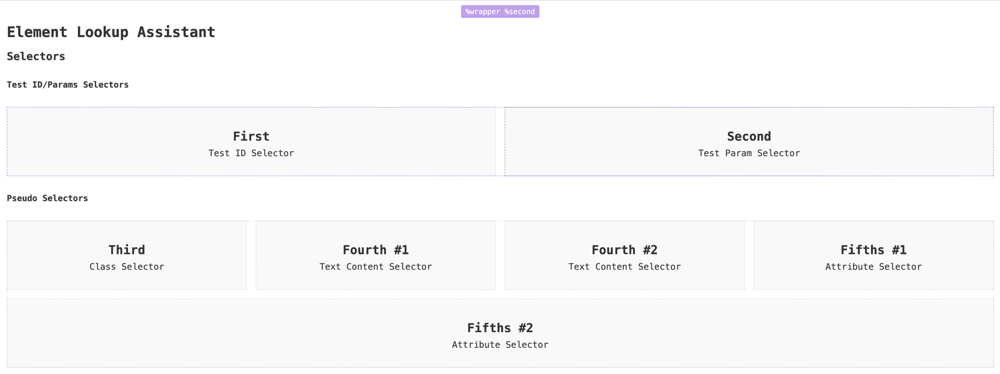

# E2EToolkit: Element Lookup Assistant

**Element Lookup Assistant** being a part of `e2e-toolkit` allows you to find out a particular element's **test id** very quickly.

### Initialization
```ts
import('e2e-toolkit-ela').then(({ ELAComponent }) => {
    ELAComponent({
        pseudoSelectorMap: {
            'third=$name': '.third',
            'fourth=$name': '.fourth:has(strong:contains($name), + p)'
        }
    });
})
```

### Configuration
#### Default config
```ts
export interface ELAConfig {
    customSelectorPrefix: string
    pseudoSelectorPrefix: string
    activateShortcut: string
    relocateShortcut: string
    pseudoSelectorMap: Record<string, string>
}

const defaultConfig: ELAConfig = {
    customSelectorPrefix: '%',
    pseudoSelectorPrefix: '%%',
    activateShortcut: 'ctrl+alt+l',
    relocateShortcut: 'ctrl+alt+p',
    pseudoSelectorMap: {}
};
```

### Usage
#### Activate
Use `CTRL+ALT+L` shortcut on your site to activate ELA


Click on a custom- or a pseudo-selector name to copy it to the clipboard and use it in your test cases along with `q` helper.
Click on a selector with a pressed `CTRL` key to copy a full path to the element (but remember it's not necessary to use a full path to reach the element, keep it as short as possible).

You can also use `CTRL+ALT+P` to change tooltip's positioning if tooltips start overlapping each other.


